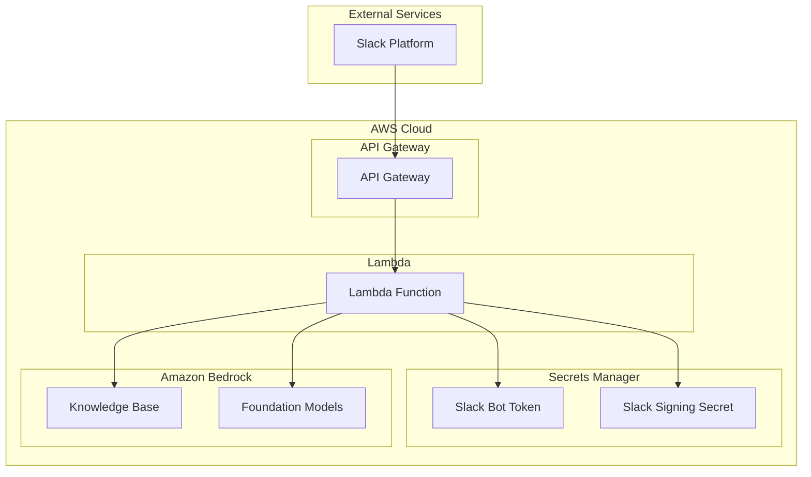

# Amazon Bedrock Knowledge Base Slack Integration Architecture

## System Overview

This implementation creates a serverless architecture that integrates Amazon Bedrock's knowledge base capabilities with Slack, allowing users to query the knowledge base directly from Slack.

## Architecture Diagram

## Component Details

### 1. API Gateway
- REST API endpoint for Slack integration
- Handles incoming Slack events
- Implements CORS for Slack domain
- Rate limiting configured (10 requests/second, burst of 20)

### 2. Lambda Function
- Python 3.12 runtime
- ARM64 architecture
- 256MB memory
- 30-second timeout
- Handles Slack event verification
- Processes user queries
- Interacts with Bedrock services

### 3. Secrets Manager
- Stores Slack Bot Token
- Stores Slack Signing Secret
- Secure credential management

### 4. Amazon Bedrock
- Knowledge Base for document storage and retrieval
- Foundation Models for generating responses
- Inference profiles for model configuration

### 5. Slack Integration
- Bot user for interaction
- Event subscription for commands
- Message formatting and delivery

## Security Considerations

1. **Authentication & Authorization**
   - Slack signing verification
   - IAM roles with least privilege
   - Secrets encryption in transit and at rest

2. **Network Security**
   - API Gateway with CORS configuration
   - Private VPC endpoints (if configured)
   - SSL/TLS encryption

3. **Data Protection**
   - Secrets stored in AWS Secrets Manager
   - IAM policies for resource access
   - Secure parameter handling

## Performance Considerations

1. **Scalability**
   - Serverless architecture
   - Auto-scaling Lambda functions
   - API Gateway throttling

2. **Optimization**
   - ARM64 architecture for cost efficiency
   - Memory and timeout configurations
   - Caching strategies (if implemented)

## Monitoring and Logging

1. **CloudWatch Integration**
   - Lambda function logs
   - API Gateway metrics
   - Error tracking

2. **Alerts and Notifications**
   - Error thresholds
   - Performance metrics
   - Security events 